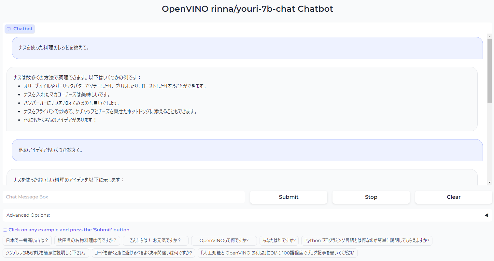

# youri-7b-chat OpenVINO Japanese chatbot demo

## Description
This is a LLM Japanese chatbot demo program using Intel OpenVINO toolkit. The demo uses [`rinna/youri-7b-chat`](https://huggingface.co/rinna/youri-7b-chat) model developed by [Rinna Co.,Ltd](https://rinna.co.jp).

## Requirement


## Install prerequisites
Recommend to use Python virtual env.<br>
You need to have Python installed.
```sh
pip install -r requirements.txt
```

|file|description|
|---|---|
|`config.yml`|The system setting file. You can specify huggingface model cache directory and device for inferencing|
|`youri-7b-chat-openvino.py`|WebUI chatbot demo using `rinna/youri-7b-chat` model. This program uses OpenVINO as inference engine.<br>You need to run `model_download.py` to download and convert the model into OpenVINO IR before you run this demo.|
|`model_download.py`|This program downloads `rinna/youri-7b-chat` model from huggingface and convert it into FP16 OpenVINO IR model.<br>The converted model will be stored in `./youri-7b-chat/FP16/` directory. Also, the original model downloaded from hugging face will be stored in `./cache/huggingface/hub/` directory.|
|`benchmark_pyt.py`|Simple benchmark program using PyTorch.|
|`benchmark_ov.py`|Simple benchmark program using OpenVINO.|

## Demo screenshot


## Test environment
- Windows 11 23H2
- Core i7-10700K, 64GB, GPU Intel A380
- OpenVINO 2023.1.0

## Special thanks
Rinna Co.,Ltd - Original developer of rinna/youri-7b-chat model.
